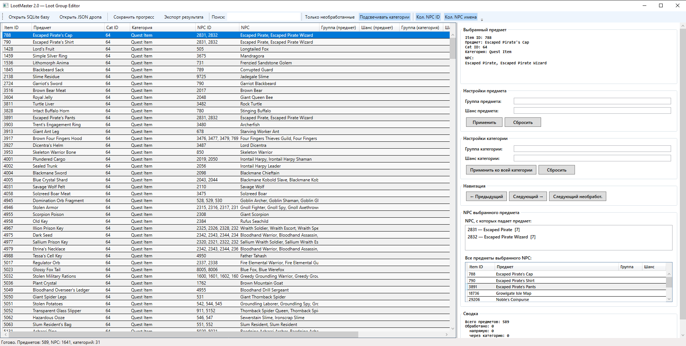
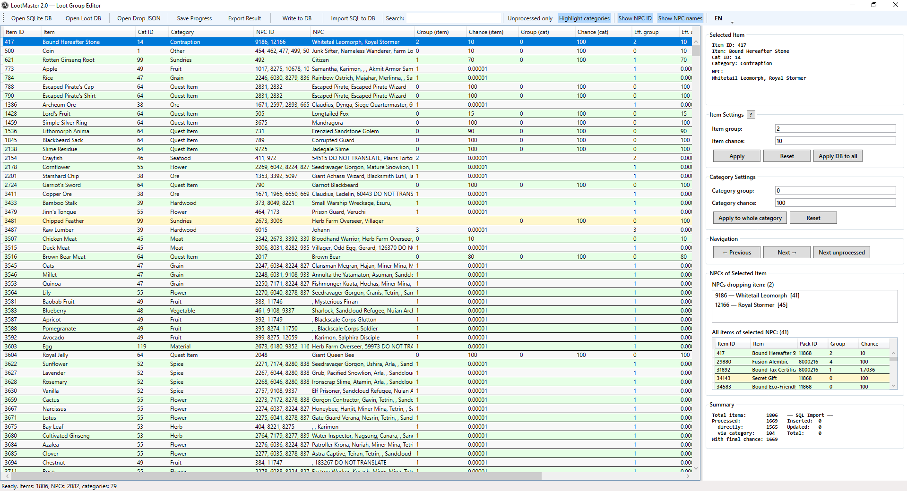

# LootMaster 2.0

A WPF desktop tool for assigning loot groups and drop chances to ArcheAge items.
Loads NPC drop tables from JSON files and item/NPC metadata from an SQLite database.




---

## Features

- Load multiple NPC loot JSON files simultaneously — duplicates are deduplicated automatically
- Assign loot group, drop chance, min/max amount, grade ID and always-drop flag per item or per entire category
- Category-level assignments cascade to all items; item-level assignments take priority
- "Apply DB to all" and "Undo DB apply" for batch operations from existing DB values
- Real-time search and filter (by item name, category, NPC ID/name)
- "Only unprocessed" filter to focus on remaining work
- NPC browser — see all NPCs that drop the selected item, and all items a selected NPC drops
- Jump to any item from the NPC browser with a double-click
- Auto-save after every change and on app close; session is restored automatically on next launch
- Export results to JSON for use in the server emulator
- Write results directly to SQLite via upsert (loots + loot_groups tables)
- Import SQL dumps (including Navicat format) directly into the loot database
- Generate patch from another SQLite DB — creates an `INSERT OR REPLACE` SQL file for review before applying
- Two separate SQLite databases supported: data DB + loot DB
- Summary panel shows cumulative SQL import and DB import statistics across sessions
- Full UI localization: switch between Russian, English, and Simplified Chinese with a single **RU/EN/ZH** toolbar button

---

## Requirements

- Windows 10 or later
- [.NET 10 Runtime](https://dotnet.microsoft.com/download/dotnet/10.0)

---

## Getting Started

1. **Open SQLite database** — click "Open SQLite DB" and select your `compact.sqlite3` file
2. **Open loot DB** *(if separate)* — click "Open Loot DB" and select `compact.server.table.sqlite3`
3. **Open loot JSON file(s)** — click "Open Drop JSON" and select one or more loot files

Supported loot JSON formats:

NPC loot:
```json
[{ "npc_id": 123, "items": [{ "item_id": 456 }] }]
```
Doodad loot:
```json
[{ "doodad_id": 322, "loot_pack_id": 6414, "items": [{ "item_id": 456 }] }]
```

4. The table populates with all items and their associated NPCs
5. Select an item, fill in group/chance in the right panel, click **Apply**
6. Use **Apply to whole category** to apply the same values to all items in a category
7. Press **Ctrl+S** to save, or use **Write to DB** / **Export Result** when done

---

## Data Files

All data is stored in the `Data\` folder next to the executable:

```
LootMaster.exe
Data\
  loot_group_progress.json      ← working progress file (auto-created, includes import stats)
  column-settings.json          ← column layout, panel widths, window size, language
  patch_YYYYMMDD_HHMMSS.sql     ← patch files generated via "Generate Patch from DB"
```

---

## Export Format

```json
{
  "items": [
    { "item_id": 456, "chance": 0.5 },
    { "item_id": 789, "chance": 1.0 }
  ]
}
```

---

## Keyboard Shortcuts

| Shortcut | Action |
|---|---|
| **Ctrl+S** | Save progress |

---

## Built With

- .NET 10 / C# 14
- WPF
- [Microsoft.Data.Sqlite](https://www.nuget.org/packages/Microsoft.Data.Sqlite)
- System.Text.Json

---

## Documentation

See [Docs/user-guide-en.md](Docs/user-guide-en.md) for full usage instructions in English.
См. [Docs/user-guide-ru.md](Docs/user-guide-ru.md) — руководство на русском языке.
简体中文版请参阅 [Docs/user-guide-ch.md](Docs/user-guide-ch.md)。
